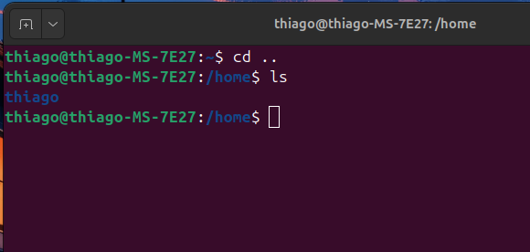
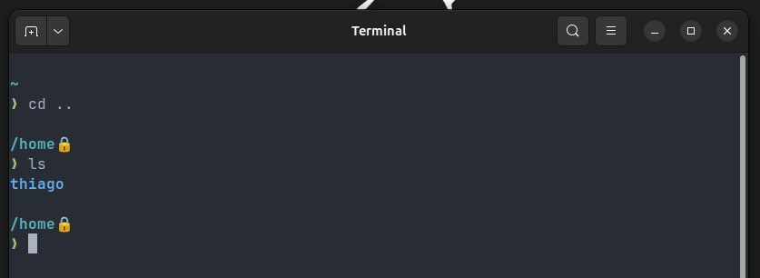

# Bash One Dark Custom

Olá Dev.

Compartilho aqui minhas preferências de tema para uso do terminal no Ubuntu, que incluem a combinação:

- **Bash** - Terminal padrão no Ubuntu Gnome.
- **JetBrainsMono Nerd Font** - Uma fonte nerd com ícones legais.
- **Starship.rs** - Prompt minimalista e rápido.
- Cores personalizadas, deixando o **shell** com uma carinha de **One Dark** (Antigo ATOM)

<details>
<summary>Resumo passo a passo do script de importação do perfil...</summary>

```bash
#!/bin/bash

# Passo 1: Gera um UUID único e guarda em uma variável.
echo "Gerando um UUID único..."
UUID=$(uuidgen)
echo "UUID gerado: $UUID"
echo

# Passo 2: Importa o novo perfil usando o UUID gerado.
# Substitua 'one_dark_profile.dconf' pelo caminho do seu arquivo de configuração de perfil.
echo "Importando o perfil para o UUID $UUID..."
dconf load /org/gnome/terminal/legacy/profiles:/:$UUID/ < "profiles/one_dark_profile.dconf"
if [ $? -eq 0 ]; then
  echo "Perfil importado com sucesso!"
else
  echo "Erro ao importar o perfil. Verifique o arquivo one_dark_profile.dconf."
  exit 1
fi
echo

# Passo 3: Adiciona o UUID à lista de perfis.
echo "Obtendo a lista atual de perfis..."
CURRENT_LIST=$(dconf read /org/gnome/terminal/legacy/profiles:/list)
if [ -z "$CURRENT_LIST" ]; then
  # Se a lista estiver vazia, cria uma nova com o UUID.
  NEW_LIST="['$UUID']"
else
  # Adiciona o novo UUID à lista existente.
  NEW_LIST=$(echo $CURRENT_LIST | sed "s/]/, '$UUID']/")
fi
echo

echo "Atualizando a lista de perfis com o novo UUID..."
dconf write /org/gnome/terminal/legacy/profiles:/list "$NEW_LIST"
if [ $? -eq 0 ]; then
  echo "Lista de perfis atualizada: $NEW_LIST"
else
  echo "Erro ao atualizar a lista de perfis."
  exit 1
fi
echo

# Passo 4: Define o novo UUID como perfil padrão.
echo "Definindo o UUID $UUID como perfil padrão..."
dconf write /org/gnome/terminal/legacy/profiles:/default "'$UUID'"
if [ $? -eq 0 ]; then
  echo "Perfil $UUID definido como padrão com sucesso!"
else
  echo "Erro ao definir o perfil padrão."
  exit 1
fi
echo

echo "Processo concluído! Reinicie o GNOME Terminal para aplicar as alterações."
```

</details>
<br>

Terminal padrão:



Terminal personalizado:



## Configuração Didática

Vou deixar aqui o passo a passo e requisitos para customizar.

- [1 - Instalando uma Fonte Nerd 🤓](docs/instalando-a-fonte-jetbrains-nerd-font.md)
- [2 - Instalando o prompt minimalista starship.rs](docs/instalando-o-starship.md)
- [3 - Cores personalizadas no terminal](docs/cores-personalizadas-no-terminal.md)
- [4 - Exportando e importando um perfil](docs/exportando-e-importando-um-perfil.md)
