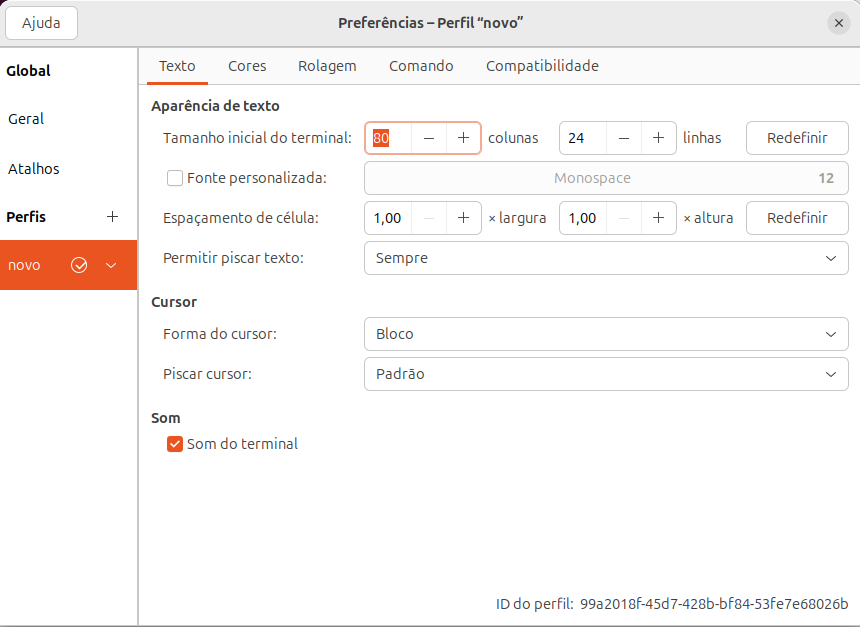
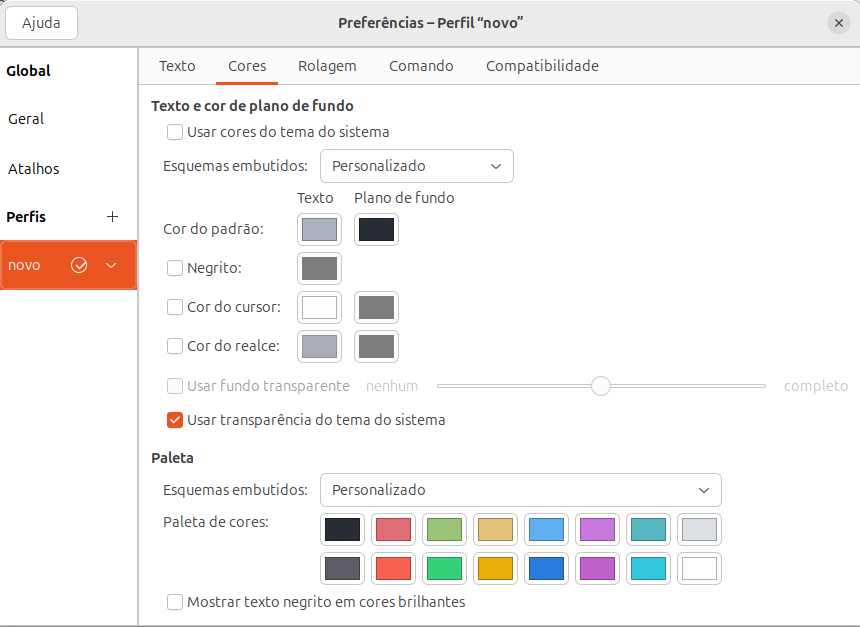

# Recriando o tema One Dark

Cada um tem seu tema e paleta de cores preferido. Se quiser personalizar o seu aqui, fique a vontade!

Passo a passo:

1. Via interface gráfica (UI), acesse `Terminal` → `Preferências` → `Perfis`.

2. Ao lado de `Perfis`, clique em `+` para criar um novo.

   

   > Veja que no rodapé é exibido o **ID do perfil** gerado. Essa informação será útil para exportar uma cópia das configurações.

3. Acesse o menu `cores` e aplique a paleta de cores:

   

## Detalhando a paleta de cores

### Texto e cor de plano de fundo

Esquemas Embutidos → `Personalizado`

**Cor do padrão:**

- Texto → #ABB2BF
- Plano de Fundo → #282C34

### Paleta

Esquemas Embutidos → `Personalizado`

**Paleta de cores:**
| Cor      | Tom    | Hex     | Visual                                                                                                      |
|----------|--------|---------|-------------------------------------------------------------------------------------------------------------|
| Preto    | Escuro | #282C34 |  |
| Preto    | Claro  | #5E5C64 |                        |
| Vermelho | Claro  | #E06C75 |                        |
| Vermelho | Escuro | #F66151 |                        |
| Verde    | Claro  | #98C379 |                        |
| Verde    | Escuro | #33D17A |                        |
| Amarelo  | Claro  | #E5C07B |                        |
| Amarelo  | Escuro | #E9AD0C |                        |
| Azul     | Claro  | #61AFEF |                        |
| Azul     | Escuro | #2A7BDE |                        |
| Roxo     | Claro  | #C678DD |                        |
| Roxo     | Escuro | #C061CB |                        |
| Ciano    | Escuro | #56B6C2 |                        |
| Ciano    | Claro  | #33C7DE |                        |
| Branco   | Escuro | #DCDFE4 |                        |
| Branco   | Claro  | #FFFFFF |  |

Pronto! Só fechar e abrir o terminal para aplicar as alterações. Obs: Pode ser necessário encerrar a sessão e fazer um novo login.

[Próximo passo](exportando-e-importando-um-perfil.md)